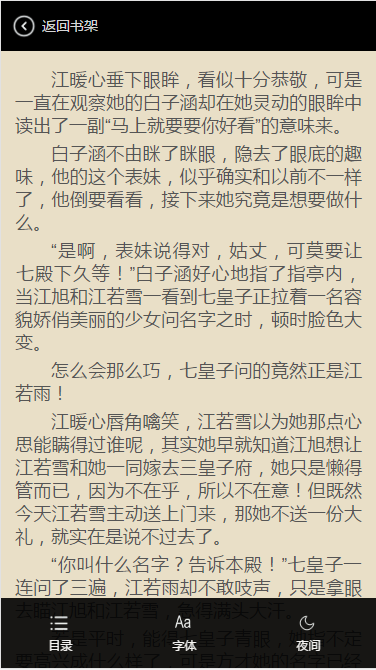

###Welcome to use MarkDown
####这是一个简单的   
> web手机阅读器

####首先利用H5 + CSS + JQuery + jsonp + localStorage存储 完成

1. 使用css来实现页面布局，各个标签的分布和展示效果
2. 使用jquery实现点击交互效果、字体大小、背景颜色的变化
3. 使用localStorage存储完成，刷新页面记忆上次设置的样式
4. 使用jsonp来实现 获取和展示数据

####js部分整体划分为三块：
+ ReaderBaseFrame(container){//UI渲染层
+ ReaderModel(){//数据交互层
+ EventHandler(){//业务事件处理层

